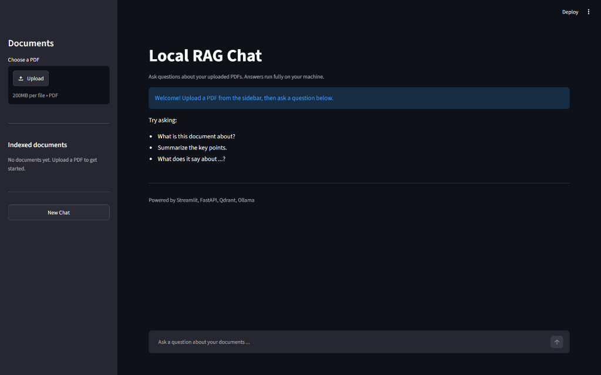
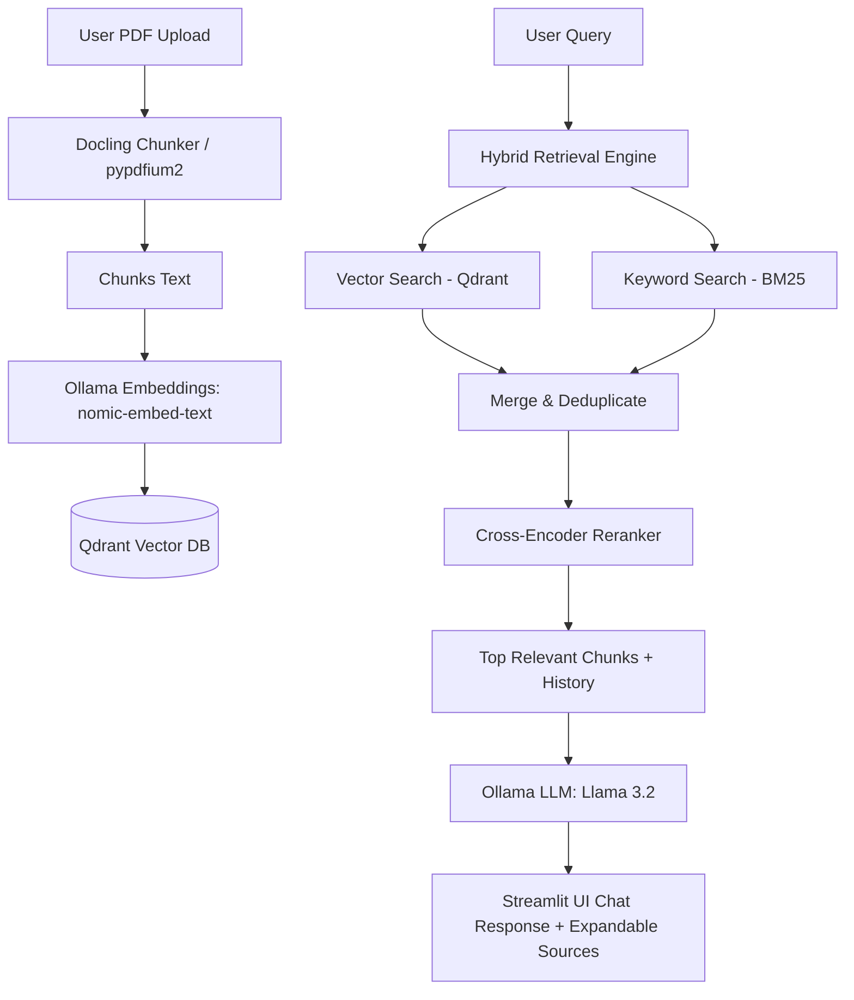

# 🤖 Local Hybrid RAG Assistant

A fully local, privacy-first Retrieval-Augmented Generation (RAG) assistant for querying and chatting with your PDF documents. Powered by **FastAPI**, **Streamlit**, **Qdrant Vector Database**, **Docling**, and **Ollama**.

---

## 📸 Screenshots & Demo

### 📊 Document Management & Dashboard


---

## ✨ Features

- **🔍 Hybrid Search Engine**: Combines dense semantic vector search (cosine similarity via Qdrant) with sparse keyword retrieval (BM25) for high retrieval accuracy.
- **⚡ Neural Reranking**: Re-scores combined candidate chunks with a Cross-Encoder (`ms-marco-MiniLM-L-6-v2`) to prioritize the most relevant context.
- **📄 Advanced Document Processing**: Uses **Docling** for deep layout-aware PDF chunking with automatic fallback text extraction via **pypdfium2**.
- **🔒 100% Offline & Private**: All embeddings (`nomic-embed-text`) and language models (`llama3.2:1b` / `llama3.1:8b`) run completely locally via **Ollama**. No data leaves your machine.
- **💾 Embedded Vector Storage**: Uses embedded file-backed **Qdrant** with support for standalone Qdrant server/Docker.
- **🧠 Multi-Turn Conversation Memory**: Retains conversation history per session to support contextual follow-up questions.
- **🎨 Sleek Streamlit UI**: Dark-mode, responsive web interface for uploading PDFs, viewing indexed documents, and inspecting retrieved source chunks.

---

## 🏗️ Architecture



---

## 📋 Prerequisites

1. **Python 3.10+** installed on your system.
2. **[Ollama](https://ollama.com/)** installed and running.
3. Download the required Ollama models:
   ```bash
   ollama pull nomic-embed-text
   ollama pull llama3.2:1b
   # Or optionally: ollama pull llama3.1:8b
   ```

---

## 🚀 Quick Start

### 1. Clone the Repository
```bash
git clone https://github.com/Manmeet2456/local-hybrid-rag.git
cd local-hybrid-rag
```

### 2. Set Up Virtual Environment
```bash
python -m venv venv
# On Windows:
.\venv\Scripts\activate
# On macOS / Linux:
source venv/bin/activate

pip install -r requirements.txt
```

### 3. Run the Application

#### Option A: One-Click Startup (Windows)
Double-click `run_app.bat` to launch both the FastAPI backend and Streamlit frontend in separate windows.

#### Option B: Manual Startup

**Terminal 1 — Backend (FastAPI):**
```bash
cd backend
uvicorn main:app --reload --host 127.0.0.1 --port 8000
```

**Terminal 2 — Frontend (Streamlit):**
```bash
cd frontend
streamlit run app.py
```

- **Frontend UI**: [http://localhost:8501](http://localhost:8501)
- **FastAPI Interactive Docs**: [http://localhost:8000/docs](http://localhost:8000/docs)

---

## 📁 Project Structure

```
├── assets/                  # UI screenshots and demo images
├── backend/
│   ├── api/                 # FastAPI routers (upload, chat, documents)
│   ├── db/                  # Qdrant client & collection management
│   ├── ingestion/           # Docling chunking & Ollama embedding pipeline
│   ├── llm/                 # Ollama chat inference & model auto-detection
│   ├── memory/              # Multi-turn conversation session history
│   ├── rag/                 # RAG orchestration pipeline
│   ├── retrieval/           # Hybrid search (vector + BM25) & Cross-Encoder reranker
│   ├── uploads/             # Stored PDF documents
│   └── main.py              # FastAPI application entrypoint
├── frontend/
│   └── app.py               # Streamlit web application
├── run_app.bat              # One-click Windows startup script
├── requirements.txt         # Project dependencies
├── .gitignore               # Git ignore rules
└── README.md                # Project documentation
```

---

## 🛠️ Tech Stack

- **Frontend**: Streamlit
- **Backend**: FastAPI, Uvicorn, Pydantic
- **Vector Database**: Qdrant Client (Local Embedded / Server)
- **Embedding Model**: `nomic-embed-text` (via Ollama)
- **Generative LLM**: `llama3.2:1b` / `llama3.1:8b` (via Ollama)
- **Document Ingestion**: Docling, pypdfium2
- **Information Retrieval**: BM25 (`rank-bm25`), Sentence-Transformers (`ms-marco-MiniLM-L-6-v2`)

---

## 📜 License
This project is open source and available under the [MIT License](LICENSE).
